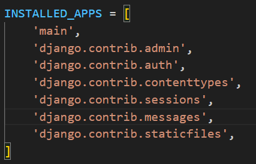
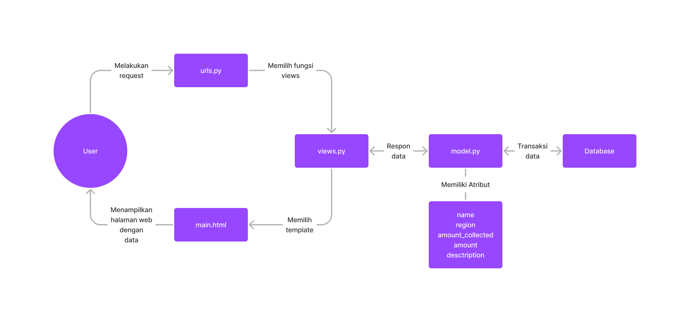

# Pengerjaan Checklist

### Membuat sebuah proyek Django baru
Pada direktori yang telah saya tentukan, Saya membuat proyek Django baru yang bernama "oculi_archive". Saya membuat proyek tersebut dengan membuka terminal di dalam direktori tersebut dan menjalankan kode :  
~~~  
django-admin startporject shopping_list
~~~  

### Membuat aplikasi main pada proyek tersebut
Saya membuat aplikasi main pada direktori proyek oculi_archive dan menjalankan kode :  
~~~
python manage.py startapp main
~~~

### Melakukan routing pada proyek agar dapat menjalankan aplikasi main
Setelah membuat aplikasi main, saya menambahkan aplikasi tersebut pada `settings.py` di direktori proyek supaya aplikasi terdaftar pada proyek tersebut.  

### Membuat model pada aplikasi dengan nama `Oculi`
Model tersebut memiliki atribut sebagai berikut
- `name` dengan tipe `CharField`.  
 Atribut tersebut akan menjelaskan nama dari model.
- `region` dengan tipe `CharField`.  
 Atribut tersebut akan menjelaskan model tersebut dapat ditemukan di area mana.
- `amount_collected` dengan tipe `IntegerField`.  
 Atribut tersebut akan menjelaskan berapa banyak item yang telah dikoleksi.
- `amount` dengan tipe `IntegerField`.  
 Atribut tersebutakan menjelaskan total banyak item yang dapat dikoleksi.
- `description` dengan tipe `TextField`.  
 Atribut tersebut mendeskripsikan item tersebut.
  
Setelah membuat model tersebut, Saya melakukan migrasi untuk menyimpan model dan atributnya pada database dengan menjalankan kode di bawah ini pada terminal.  
~~~
python manage.py makemigrations
python manage.py migrate
~~~

 ### Membuat fungsi `show_main` pada `views.py` untuk dikembalikan ke dalam sebuah template HTML
 Pada `views.py`, Saya membuat fungsi yang nantinya akan memberikan data kepada `main.html`.
 ~~~
from django.shortcuts import render
from .models import Oculi

name = ["Anemoculus", "Geoculus", "Electroculus", "Dendoculus", "Hydroculus"]
region = ["Mondstadt", "Liyue", "Inazuma", "Sumeru", "Fontaine"]
amount_collected = [0,0,0,0,0]
amount = [66, 131, 181, 271, 85]
description = ["A substance that has accumulated intense Anemo energy.",
               "A substance that has accumulated intense Geo energy.",
               "A substance that has accumulated intense Electro energy.",
               "A substance that has accumulated intense Dendro energy.", 
               "A substance that has accumulated intense Hydro energy."]

for i in range(len(name)) :
    bruh = Oculi(name=name[i], region=region[i], amount_collected=amount_collected[i],
                            amount=amount[i], description=description[i])
    bruh.save()
        
# Create your views here.
def show_main(request):

    # Iterating through the data
    
    b = Oculi.objects.all()
    context = {
        'oculus' : b
    }

    return render(request, "main.html", context)
 ~~~
 Di luar fungsi `show_main`, Saya menyimpan data-data pada list. Setelah itu, Saya membuat object `Oculi` dengan mengiterasikan data tersebut, membuat object, dan menyimpannya dengan method `save()`.  
 Pada fungsi, Saya membuat `context` yang merupakan sebuah dictionary. Keys dari dictionary tersebut akan menjadi variable yang dapat digunakan pada `main.html` dan values merupakan datanya.

### Membuat routing pada `urls.py`
Pada langkah ini Saya membuat `urls.py` pada direktori aplikasi `main` dan gunanya untuk memetakan fungsi yang telah dibuat pada `views.py` tadi.
~~~
from django.urls import path
from main.views import show_main

app_name = 'main'

urlpatterns = [
    path('', show_main, name='show_main'),
]
~~~

Di dalam fungsi `path`, Saya membuat parameter pertama sebagai `''` supaya halaman aplikasi tersebut muncul pada halaman utama localpath. Parameter kedua berisikan fungsi yang telah dibuat pada `views.py` dan parameter `name` adalah untuk pengakses fungsi tersebut.
  
  
# Bagan request client dan kaitan antara `urls.py`, `views.py`, `models.py`, dan `main.html`

- **urls.py**  
 Saat User melakukan request kepada website, request tersebut akan dikirim kepada fungsi yang bersesuaian pada halaman tersebut yang terdapat pada urlpatterns halaman tersebut. Pada halaman utama website ini, disambungkan dengan fungsi `show_main` yang berada pada `views.py`,
- **views.py**
 Pada `views.py` terdapat fungsi `show_main` yang memiliki parameter `request` yang akan menerima request dari User. Pada fungsi tersebut, terdapat `context` yang merupakan dictionary untuk memberikan data pada `main.html` pada bagian return fungsi tersebut. Fungsi tersebut memilih`main.html` untuk mengirim data yang didapat dari database untuk ditampilkan nanti ke User.
- **models.py**
 Semua bentuk model yang digunakan pada aplikasi dibuat dengan bentuk class pada file tersebut. Pada aplikasi main ini, dibuat sebuah model Oculi yang memiliki beberapa atribut. Pada `views.py`, dibuat berbagai object Oculi yang akan dikirim ke `main.html`.
- **main.html**
  Data yang diterima dari `views.py` akan ditampilkan pada file html ini dan dapat dilihat oleh User.

# Alasan menggunakan virtual environment
Kita menggunakan virtual environment pada penggunaan Django dikarenakan memiliki manfaat seperti :
- **Stable Environments**
 Dengan menggunakan virtual environments, kita mengisolasikan project yang kita buat dari sistem yang lain. Ini berarti perubahan yang terjadi pada sistem atau proyek yang lain tidak akan mengganggu stabilitas dari proyek yang sedang kita buat.
- **Reproducible Enviroments**
 Virtual environment menyediakan kita fasilitas untuk membuat enviroment yang dapat dibuat ulang dengan memberikan detail versi Python dan packages lain yang diperlukan dari proyek yang sedang kita buat.
  
Sebenernya tidak diwajibkan untuk menggunakan virtual environment. Namun, jika meng-install semua package pada local environment, itu semua bisa tabrakan ketika kita sedang bekerja pada berbagai proyek yang berbeda.

# Pengertian dan perbedaan dari MVC, MVT, dan MVVM
- MVC (Model-View-Controller):
    - Model: Mewakili data dan logika bisnis aplikasi. Ini adalah bagian dari aplikasi yang bertanggung jawab untuk memproses data, berkomunikasi dengan basis data, dan melakukan operasi lainnya yang tidak langsung terkait dengan tampilan.
    - View: Menampilkan data kepada pengguna dan menangani tampilan antarmuka pengguna. Ini adalah elemen yang digunakan untuk menghasilkan output yang terlihat oleh pengguna.
    - Controller: Bertindak sebagai perantara antara Model dan View. Ini mengelola input dari pengguna dan memutuskan bagaimana meresponsnya dengan memperbarui Model atau View yang sesuai.
- MVT (Model-View-Template):
    - Model: Sama seperti dalam MVC, ini adalah bagian aplikasi yang berurusan dengan data dan logika bisnis.
    - View: Bertanggung jawab untuk tampilan antarmuka pengguna.
    - Template: Ini adalah bagian yang unik untuk MVT dan merupakan bagian yang berbeda dari MVC. Template digunakan untuk mengontrol bagaimana data dari Model disajikan dalam tampilan. Template dapat dilihat sebagai representasi statis dari tampilan yang berisi instruksi untuk menampilkan data dari Model ke View.
- MVVM (Model-View-ViewModel):
    - Model: Sama seperti dalam MVC dan MVT, ini adalah bagian aplikasi yang mengelola data dan logika bisnis.
    - View: Ini adalah tampilan antarmuka pengguna seperti pada pola lainnya.
    - ViewModel: Bagian ini berperan sebagai perantara antara Model dan View. ViewModel mengambil data dari Model dan memformatnya agar dapat dengan mudah ditampilkan oleh View. Ini juga mengelola tindakan dan perintah yang dikirim oleh pengguna dan mengirimkannya ke Model jika perlu.

Adapun perbedaan dari ketiganya adalah sebagai berikut :
- MVC memisahkan tugas menjadi Model, View, dan Controller dengan Controller sebagai pengendali interaksi.
- MVT mirip dengan MVC, tetapi menggunakan Template sebagai bagian terpisah yang mengontrol tampilan.
- MVVM memisahkan tugas menjadi Model, View, dan ViewModel dengan ViewModel bertindak sebagai perantara yang mengelola tampilan dan interaksi pengguna.
>>>>>>> 15e9663 (Push sekali ini)
