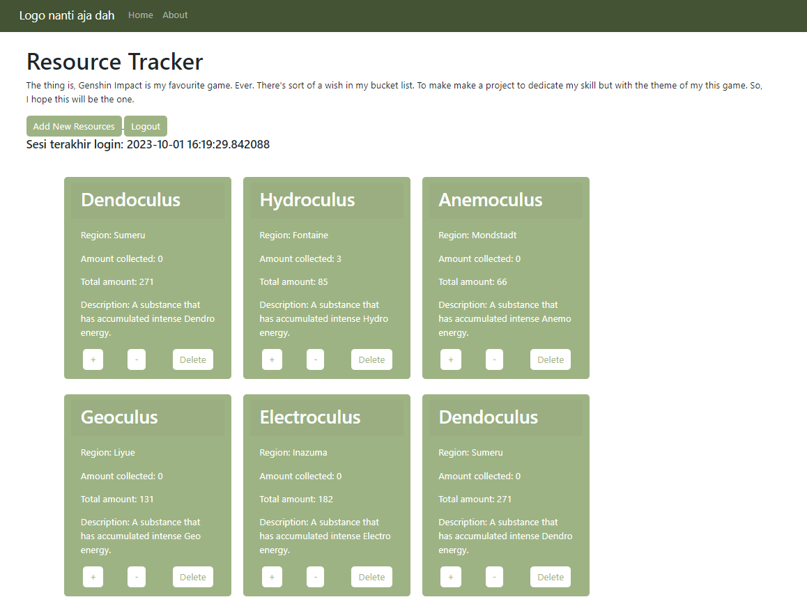

# Tugas 2

### Membuat sebuah proyek Django baru
Pada direktori yang telah saya tentukan, Saya membuat proyek Django baru yang bernama "oculi_archive". Saya membuat proyek tersebut dengan membuka terminal di dalam direktori tersebut dan menjalankan kode :  
~~~  
django-admin startporject shopping_list
~~~  

### Membuat aplikasi main pada proyek tersebut
Saya membuat aplikasi main pada direktori proyek oculi_archive dan menjalankan kode :  
~~~
python manage.py startapp main
~~~

### Melakukan routing pada proyek agar dapat menjalankan aplikasi main
Setelah membuat aplikasi main, saya menambahkan aplikasi tersebut pada `settings.py` di direktori proyek supaya aplikasi terdaftar pada proyek tersebut.  

### Membuat model pada aplikasi dengan nama `Oculi`
Model tersebut memiliki atribut sebagai berikut
- `name` dengan tipe `CharField`.  
 Atribut tersebut akan menjelaskan nama dari model.
- `region` dengan tipe `CharField`.  
 Atribut tersebut akan menjelaskan model tersebut dapat ditemukan di area mana.
- `amount_collected` dengan tipe `IntegerField`.  
 Atribut tersebut akan menjelaskan berapa banyak item yang telah dikoleksi.
- `amount` dengan tipe `IntegerField`.  
 Atribut tersebutakan menjelaskan total banyak item yang dapat dikoleksi.
- `description` dengan tipe `TextField`.  
 Atribut tersebut mendeskripsikan item tersebut.
  
Setelah membuat model tersebut, Saya melakukan migrasi untuk menyimpan model dan atributnya pada database dengan menjalankan kode di bawah ini pada terminal.  
~~~
python manage.py makemigrations
python manage.py migrate
~~~

 ### Membuat fungsi `show_main` pada `views.py` untuk dikembalikan ke dalam sebuah template HTML
 Pada `views.py`, Saya membuat fungsi yang nantinya akan memberikan data kepada `main.html`.
 ~~~
from django.shortcuts import render
from .models import Oculi

name = ["Anemoculus", "Geoculus", "Electroculus", "Dendoculus", "Hydroculus"]
region = ["Mondstadt", "Liyue", "Inazuma", "Sumeru", "Fontaine"]
amount_collected = [0,0,0,0,0]
amount = [66, 131, 181, 271, 85]
description = ["A substance that has accumulated intense Anemo energy.",
               "A substance that has accumulated intense Geo energy.",
               "A substance that has accumulated intense Electro energy.",
               "A substance that has accumulated intense Dendro energy.", 
               "A substance that has accumulated intense Hydro energy."]

for i in range(len(name)) :
    bruh = Oculi(name=name[i], region=region[i], amount_collected=amount_collected[i],
                            amount=amount[i], description=description[i])
    bruh.save()
        
# Create your views here.
def show_main(request):

    # Iterating through the data
    
    b = Oculi.objects.all()
    context = {
        'oculus' : b
    }

    return render(request, "main.html", context)
 ~~~
 Di luar fungsi `show_main`, Saya menyimpan data-data pada list. Setelah itu, Saya membuat object `Oculi` dengan mengiterasikan data tersebut, membuat object, dan menyimpannya dengan method `save()`.  
 Pada fungsi, Saya membuat `context` yang merupakan sebuah dictionary. Keys dari dictionary tersebut akan menjadi variable yang dapat digunakan pada `main.html` dan values merupakan datanya.

### Membuat routing pada `urls.py`
Pada langkah ini Saya membuat `urls.py` pada direktori aplikasi `main` dan gunanya untuk memetakan fungsi yang telah dibuat pada `views.py` tadi.
~~~
from django.urls import path
from main.views import show_main

app_name = 'main'

urlpatterns = [
    path('', show_main, name='show_main'),
]
~~~

Di dalam fungsi `path`, Saya membuat parameter pertama sebagai `''` supaya halaman aplikasi tersebut muncul pada halaman utama localpath. Parameter kedua berisikan fungsi yang telah dibuat pada `views.py` dan parameter `name` adalah untuk pengakses fungsi tersebut.
  
  
# Bagan request client dan kaitan antara `urls.py`, `views.py`, `models.py`, dan `main.html`

- **urls.py**  
 Saat User melakukan request kepada website, request tersebut akan dikirim kepada fungsi yang bersesuaian pada halaman tersebut yang terdapat pada urlpatterns halaman tersebut. Pada halaman utama website ini, disambungkan dengan fungsi `show_main` yang berada pada `views.py`,
- **views.py**
 Pada `views.py` terdapat fungsi `show_main` yang memiliki parameter `request` yang akan menerima request dari User. Pada fungsi tersebut, terdapat `context` yang merupakan dictionary untuk memberikan data pada `main.html` pada bagian return fungsi tersebut. Fungsi tersebut memilih`main.html` untuk mengirim data yang didapat dari database untuk ditampilkan nanti ke User.
- **models.py**
 Semua bentuk model yang digunakan pada aplikasi dibuat dengan bentuk class pada file tersebut. Pada aplikasi main ini, dibuat sebuah model Oculi yang memiliki beberapa atribut. Pada `views.py`, dibuat berbagai object Oculi yang akan dikirim ke `main.html`.
- **main.html**
  Data yang diterima dari `views.py` akan ditampilkan pada file html ini dan dapat dilihat oleh User.

# Alasan menggunakan virtual environment
Kita menggunakan virtual environment pada penggunaan Django dikarenakan memiliki manfaat seperti :
- **Stable Environments**
 Dengan menggunakan virtual environments, kita mengisolasikan project yang kita buat dari sistem yang lain. Ini berarti perubahan yang terjadi pada sistem atau proyek yang lain tidak akan mengganggu stabilitas dari proyek yang sedang kita buat.
- **Reproducible Enviroments**
 Virtual environment menyediakan kita fasilitas untuk membuat enviroment yang dapat dibuat ulang dengan memberikan detail versi Python dan packages lain yang diperlukan dari proyek yang sedang kita buat.
  
Sebenernya tidak diwajibkan untuk menggunakan virtual environment. Namun, jika meng-install semua package pada local environment, itu semua bisa tabrakan ketika kita sedang bekerja pada berbagai proyek yang berbeda.

# Pengertian dan perbedaan dari MVC, MVT, dan MVVM
- MVC (Model-View-Controller):
    - Model: Mewakili data dan logika bisnis aplikasi. Ini adalah bagian dari aplikasi yang bertanggung jawab untuk memproses data, berkomunikasi dengan basis data, dan melakukan operasi lainnya yang tidak langsung terkait dengan tampilan.
    - View: Menampilkan data kepada pengguna dan menangani tampilan antarmuka pengguna. Ini adalah elemen yang digunakan untuk menghasilkan output yang terlihat oleh pengguna.
    - Controller: Bertindak sebagai perantara antara Model dan View. Ini mengelola input dari pengguna dan memutuskan bagaimana meresponsnya dengan memperbarui Model atau View yang sesuai.
- MVT (Model-View-Template):
    - Model: Sama seperti dalam MVC, ini adalah bagian aplikasi yang berurusan dengan data dan logika bisnis.
    - View: Bertanggung jawab untuk tampilan antarmuka pengguna.
    - Template: Ini adalah bagian yang unik untuk MVT dan merupakan bagian yang berbeda dari MVC. Template digunakan untuk mengontrol bagaimana data dari Model disajikan dalam tampilan. Template dapat dilihat sebagai representasi statis dari tampilan yang berisi instruksi untuk menampilkan data dari Model ke View.
- MVVM (Model-View-ViewModel):
    - Model: Sama seperti dalam MVC dan MVT, ini adalah bagian aplikasi yang mengelola data dan logika bisnis.
    - View: Ini adalah tampilan antarmuka pengguna seperti pada pola lainnya.
    - ViewModel: Bagian ini berperan sebagai perantara antara Model dan View. ViewModel mengambil data dari Model dan memformatnya agar dapat dengan mudah ditampilkan oleh View. Ini juga mengelola tindakan dan perintah yang dikirim oleh pengguna dan mengirimkannya ke Model jika perlu.

Adapun perbedaan dari ketiganya adalah sebagai berikut :
- MVC memisahkan tugas menjadi Model, View, dan Controller dengan Controller sebagai pengendali interaksi.
- MVT mirip dengan MVC, tetapi menggunakan Template sebagai bagian terpisah yang mengontrol tampilan.
- MVVM memisahkan tugas menjadi Model, View, dan ViewModel dengan ViewModel bertindak sebagai perantara yang mengelola tampilan dan interaksi pengguna.

# Tugas 3
## Apa perbedaan antara form POST dan form GET dalam Django?
GET dan POST adalah method HTTP yang digunakan ketika berurusan dengan forms.  
Pengisian form Django diberikan dengan menggunakan metode POST, yang mana browser akan mengumpulkan data form, meng-encode data tersebut untuk transmisi, dan akan menerima respons tersebut.  
GET mengumpulkan data ke dalam bentuk string, dan menggunakan string tersebut untuk membuat sebuah URL. URL tersebut berisikan alamat data tersebut harus dikirim, termasuk keys dan values dari data tersebut.  

## Apa perbedaan utama antara XML, JSON, dan HTML dalam konteks pengiriman data?
- XML adalah bahasa markup yang menggunakan tag untuk mendefinisikan struktur dan makna data. XML dapat digunakan untuk menyimpan data yang kompleks dan beranotasi, seperti dokumen, grafik, atau metadata. XML memisahkan data dari HTML dan menyederhanakan proses perubahan platform.  
- JSON adalah format pertukaran data yang terbuka dan ringan yang menggunakan pasangan kunci-nilai untuk merepresentasikan data. JSON dapat digunakan untuk menyimpan data yang sederhana dan terstruktur, seperti objek, array, atau nilai primitif. JSON juga lebih mudah dibaca dan ditulis oleh manusia dan mesin daripada XML.  
- HTML adalah bahasa markup yang digunakan untuk membuat halaman web dan aplikasi web. HTML menggunakan tag untuk menentukan tata letak dan penampilan data. HTML dirancang untuk menampilkan data, bukan untuk mengangkut data. HTML tidak dapat menyimpan data yang kompleks atau terstruktur seperti XML atau JSON.   

## Mengapa JSON sering digunakan dalam pertukaran data antara aplikasi web modern?
- JSON memiliki struktur data yang sederhana dan mudah dipahami oleh manusia dan mesin. JSON juga mendukung semua browser dan sebagian besar teknologi backend.  
- JSON memiliki file yang lebih ringan daripada XML, format pertukaran data lain yang sering digunakan. Hal ini membuat JSON lebih cepat dan efisien dalam mengirim dan menerima data melalui jaringan.  
- JSON dapat menyimpan data yang ringan dan terstruktur, seperti objek, array, atau nilai primitif. Hal ini cocok untuk aplikasi web modern yang membutuhkan data yang dinamis dan interaktif.  
- JSON dapat digunakan dengan berbagai bahasa pemrograman, seperti PHP, Python, Ruby, C++, Perl, dan tentu saja JavaScript. Hal ini memberikan fleksibilitas dan kompatibilitas bagi developer untuk memilih bahasa yang sesuai dengan kebutuhan mereka.  
## Jelaskan bagaimana cara kamu mengimplementasikan checklist di atas secara step-by-step (bukan hanya sekadar mengikuti tutorial).
### Membuat `base.html` sebagai template untuk template-template html lainnya
~~~

<!DOCTYPE html>
<html lang="en">
    <head>
        <meta charset="UTF-8" />
        <meta
            name="viewport"
            content="width=device-width, initial-scale=1.0"
        />
        
        
    </head>

    <body>
        
        
    </body>
</html>
~~~
### Mengedit `TEMPLATES` yang ada pads `settings.py` supaya `base.html` terdeteksi sebagai berkas template
~~~
...
DATABASES = {
    'default': {
        'ENGINE': 'django.db.backends.sqlite3',
        'NAME': BASE_DIR / 'db.sqlite3',
    }
}
...
~~~
### Mengubah `main.html` supaya meng-extend dari `base.html`
~~~

...
~~~
### Membuat `forms.py` untuk membuat struktur form dan meng-import form tersebut pada `views.py`
ModelForm di-import untuk mendapatkan properti dari form yang ada pada django untuk form yang ingin kita buat. Setelah itu kita akan membuat class ProductForm yang telah menginherit ModelForm dan memberikan properti `model` dengan model yang telah kita buat dan memberikan properti `fields` dengan properti dari model tersebut.
~~~
from django.forms import ModelForm
from main.models import Oculi

class ProductForm(ModelForm):
    class Meta:
        model = Oculi
        fields = ["name", "region", "amount_collected", "amount", "description"]
~~~
### Membuat fungsi baru untuk menambahkan data produk secara otomatis
Setelah membuat bentuk dari form, kita membuat fungsi baru untuk menambahkan data produk secara otomatis setelah form sudah benar dan di-submit oleh user.
~~~
def create_product(request):
    form = ProductForm(request.POST or None)

    if form.is_valid() and request.method == "POST":
        form.save()
        return HttpResponseRedirect(reverse('main:show_main'))

    context = {'form': form}
    return render(request, "create_product.html", context)
~~~
### Mengubah fungsi `show_main` pada `views.py` supaya data dapat diakses pada `main.html`
Memberikan variable `oculus` supaya model Oculi dapat diakses pada `main.html`.
~~~
def show_main(request):

    # Iterating through the data
    
    oculi = Oculi.objects.all()
    context = {
        'name' : "Rizki Maulana",
        'class' : "PBP-C",
        'oculus' : oculi,
    }
~~~
### Menambahkan `create_product` ke `urls.py` dan membuat path yang sesuai
~~~
def create_product(request):
    form = ProductForm(request.POST or None)

    if form.is_valid() and request.method == "POST":
        form.save()
        return HttpResponseRedirect(reverse('main:show_main'))

    context = {'form': form}
    return render(request, "create_product.html", context)
~~~
### Membuat `create_product.html`
~~~
 


<h1>Add New Product</h1>

<form method="POST">
    
    <table>
        {{ form.as_table }}
        <tr>
            <td></td>
            <td>
                <input type="submit" value="Add Product"/>
            </td>
        </tr>
    </table>
</form>


~~~
Kode HTML tersebut akan mendefinisikan template untuk menambahkan object baru. Kode tersebut meng-extend dari base template, membuat struktur, menambahkan proteksi CSRF, dan me-render field form pada tabel HTML. Ketika user men-submit form tersebut, data akan dikirimkan ke server.
### Membuat fungsi `show_json` dan `show_xml` pada `views.py` dan menambahkannya pada `urls.py`
- Fungsi `show_json`: 
    ~~~
    def show_json(request):
        data = Oculi.objects.all()
        return HttpResponse(serializers.serialize("json", data), content_type="application/json")
    ~~~
- Fungsi `show_xml` : 
    ~~~
    def show_xml(request):
        data = Oculi.objects.all()
        return HttpResponse(serializers.serialize("xml", data), content_type="application/xml")
    ~~~
- Meng-import kedua fungsi tersebut pada `urls.py`
    ~~~
    from main.views import show_main, create_product, show_xml, show_json
    ~~~
- Membuat url untuk kedua fungsi tersebut agar dapat diakses sesuai url-nya masing-masing :
    ~~~
    ...
    path('xml/', show_xml, name='show_xml'), 
    path('json/', show_json, name='show_json'), 
    ...
    ~~~
### Membuat fungsi  `show_xml_by_id` dan `show_json_by_id` pada `views.py` dan menambahkannya pada `urls.py`
- Fungsi `show_xml_by_id` :
    ~~~
    def show_xml_by_id(request, id):
        data = Oculi.objects.filter(pk=id)
        return HttpResponse(serializers.serialize("xml", data), content_type="application/xml")
    ~~~
- Fungsi `show_json_by_id` :
    ~~~
    def show_json_by_id(request, id):
        data = Oculi.objects.filter(pk=id)
        return HttpResponse(serializers.serialize("json", data), content_type="application/json")
    ~~~
- Meng-import kedua fungsi tersebut pada `urls.py` :
    ~~~
    from main.views import show_main, create_product, show_xml, show_json, show_xml_by_id, show_json_by_id 
    ~~~
- Membuat url untuk kedua fungsi tersebut agar dapat diakses sesuai url-nya masing-masing : 
    ~~~
    ...
    path('xml/<int:id>/', show_xml_by_id, name='show_xml_by_id'),
    path('json/<int:id>/', show_json_by_id, name='show_json_by_id'), 
    ...
    ~~~

## Mengakses kelima URL tersebut menggunakan Postman
- HTML  
    
- JSON  
    
- XML
    
- JSON by ID  
    
- XML by ID  
    

# Tugas 4
## Apa itu Django UserCreationForm, dan jelaskan apa kelebihan dan kekurangannya?
Django UserCreationForm adalah sebuah formulir yang digunakan untuk membuat pengguna baru yang dapat menggunakan aplikasi web kita. Formulir ini memiliki tiga bidang: username, password1, dan password2 (yang pada dasarnya digunakan untuk konfirmasi password). Untuk menggunakan UserCreationForm, kita perlu mengimpornya dari django.contrib.auth.forms¹.

Kelebihan dari UserCreationForm adalah:

- Formulir ini sudah menyediakan validasi dan sanitasi untuk bidang username, password1, dan password2, sehingga kita tidak perlu menulisnya sendiri.
- Formulir ini juga sudah menangani kasus-kasus seperti username yang sudah ada, password yang terlalu lemah, atau password yang tidak cocok.
- Formulir ini mudah digunakan dan dapat dikustomisasi dengan menambahkan atau mengubah bidang-bidang lain sesuai kebutuhan kita.

Kekurangan dari UserCreationForm adalah:

- Formulir ini hanya cocok untuk skenario autentikasi yang sederhana, yaitu menggunakan username dan password saja. Jika kita ingin menggunakan metode autentikasi lain, seperti email, nomor telepon, atau media sosial, kita perlu membuat formulir sendiri atau menggunakan pustaka pihak ketiga.
- Formulir ini tidak menyediakan fitur tambahan seperti mengirim email konfirmasi, mengatur hak akses, atau mengelola profil pengguna. Kita perlu menambahkan fitur-fitur tersebut secara manual atau menggunakan pustaka pihak ketiga.

## Apa perbedaan antara autentikasi dan otorisasi dalam konteks Django, dan mengapa keduanya penting?
Autentikasi adalah proses verifikasi identitas pengguna. Pada implementasinya biasanya menggunakan form untuk login. Sedangkan Otorisasi adalah pengendalian hak akses pengguna setelah pengguna tersebut berhasil diautentikasi.Pada proyek ini, autentikasi berupa proses login dengan Username dan Password yang sesuai dan proses otorisasinya adalah hanya dapat melihat dan menambahkan produk yang dimiliki oleh User tersebut saja.  

Kedua fitur itu sangatlah penting bagi website. Fitur tersebut mengatur apa fungsi dari website tersebut dan memberikan fasilitas-fasilitas yang unik kepada website tersebut. Selain dari itu, fitur tersebut sangatlah penting untuk memproteksi data dari akses yang bukan miliknya.

## Apa itu cookies dalam konteks aplikasi web, dan bagaimana Django menggunakan cookies untuk mengelola data sesi pengguna?
Cookies adalah sejenis data yang disimpan oleh server web di komputer pengguna dan kemudian dikirim kembali ke server setiap kali permintaan dilakukan oleh browser pengguna. Cookies adalah cara umum untuk menyimpan informasi pada sisi klien (browser) dalam konteks aplikasi web. Mereka digunakan untuk berbagai tujuan, termasuk mengelola sesi pengguna, menyimpan preferensi, dan melacak aktivitas pengguna.  

Dalam konteks Django, cookies sering digunakan untuk mengelola data sesi pengguna. Sesuai dengan pendekatan stateless HTTP, di mana setiap permintaan dari browser dianggap independen, Django menggunakan cookies untuk mengidentifikasi dan melacak sesi pengguna.

##  Apakah penggunaan cookies aman secara default dalam pengembangan web, atau apakah ada risiko potensial yang harus diwaspadai?
Penggunaan cookies dalam pengembangan web bisa dianggap aman secara default, tetapi ada beberapa risiko yang perlu diperhatikan. Cookies dapat digunakan untuk menyimpan informasi sensitif dan jika tidak diimplementasikan dengan baik, data pengguna bisa terancam keamanannya. Selain itu, serangan XSS dan CSRF dapat mengancam keamanan cookies jika tidak ada langkah-langkah keamanan yang cukup. Selain itu, cookies juga dapat digunakan untuk melacak pengguna tanpa izin mereka, yang dapat menimbulkan masalah privasi dan hukum.   

Oleh karena itu, pengembang web harus mematuhi praktik terbaik keamanan, menggunakan HTTPS, mengatur flag HttpOnly, dan memberikan informasi yang jelas serta meminta persetujuan pengguna saat menggunakan cookies untuk melacak aktivitas mereka. Keamanan cookies sangat bergantung pada implementasi dan pengelolaannya, sehingga perhatian terus-menerus terhadap praktik terkini dalam pengembangan web yang aman sangat penting.

## Jelaskan bagaimana cara kamu mengimplementasikan checklist di atas secara step-by-step (bukan hanya sekadar mengikuti tutorial).
### Menambahkan Halaman Register
- Mengimport `redirect`, `UserCreationForm`, dan `messages`
    ~~~
    from django.shortcuts import redirect
    from django.contrib.auth.forms import UserCreationForm
    from django.contrib import messages  
    ~~~
- Membuat berkas `register.html`
    ~~~
    

    
        <title>Register</title>
    

      

    

        <h1>Register</h1>  

            <form method="POST" >  
                  
                <table>  
                    {{ form.as_table }}  
                    <tr>  
                        <td></td>
                        <td><input type="submit" name="submit" value="Daftar"/></td>  
                    </tr>  
                </table>  
            </form>

          
            <ul>   
                  
                    <li>{{ message }}</li>  
                      
            </ul>   
        

    
  

    
    ~~~
- Membuat fungsi `register` untuk menghubungkan html templates dan halaman pendaftaran
    ~~~
    def register(request):
    form = UserCreationForm()

    if request.method == "POST":
        form = UserCreationForm(request.POST)
        if form.is_valid():
            form.save()
            messages.success(request, 'Your account has been successfully created!')
            return redirect('main:login')
    context = {'form':form}
    return render(request, 'register.html', context)
    ~~~
- Mengimpor fungsi `register` dan menambahkan path url pada `urls.py`
    ~~~
    from main.views import register
    ~~~

    ~~~
    ...
    path('register/', register, name='register'), 
    ...
    ~~~

### Menambahkan Halaman Login
- Mengimport `authenticate` dan `login` pada `views.py`
    ~~~
    from django.contrib.auth import authenticate, login
    ~~~
- Membuat fungsi `login_user` pada `views.py`
    ~~~
    def login_user(request):
    if request.method == 'POST':
        username = request.POST.get('username')
        password = request.POST.get('password')
        user = authenticate(request, username=username, password=password)
        if user is not None:
            login(request, user)
            return redirect('main:show_main')
        else:
            messages.info(request, 'Sorry, incorrect username or password. Please try again.')
    context = {}
    return render(request, 'login.html', context)
    ~~~
- Membuat template HTML `login.html`
    ~~~
    

    
        <title>Login</title>
    

    

    

        <h1>Login</h1>

        <form method="POST" action="">
            
            <table>
                <tr>
                    <td>Username: </td>
                    <td><input type="text" name="username" placeholder="Username" class="form-control"></td>
                </tr>

                <tr>
                    <td>Password: </td>
                    <td><input type="password" name="password" placeholder="Password" class="form-control"></td>
                </tr>

                <tr>
                    <td></td>
                    <td><input class="btn login_btn" type="submit" value="Login"></td>
                </tr>
            </table>
        </form>

        
            <ul>
                
                    <li>{{ message }}</li>
                
            </ul>
             

        Don't have an account yet? <a href="">Register Now</a>

    

    
    ~~~
- Mengimport fungsi `login_user` dan membuat path url pada `urls.py`
    ~~~
    from main.views import login_user
    ~~~
    ~~~
    ...
    path('login/', login_user, name='login'),
    ...
    ~~~
### Menambahkan Fungsi Logout
- Mengimport `logout` pada `views.py`
    ~~~
    from django.contrib.auth import logout
    ~~~
- Membuat fungsi `logout_user`
    ~~~
    def logout_user(request):
        logout(request)
        return redirect('main:login')
    ~~~
- Membuat bagian kode untuk logout pada `main.html`
    ~~~
    ...
    <a href="">
        <button>
            Logout
        </button>
    </a>
    ...
    ~~~
- Mengimport fungsi `logout_user` dan menambahkan path url pada `urls.py`
    ~~~
    from main.views import logout_user
    ~~~
    ~~~
    ...
    path('logout/', logout_user, name='logout'),
    ...
    ~~~

### Merestriksi Akses Halaman Main
- Mengimport `login_required` pada `views.py`
    ~~~
    from django.contrib.auth.decorators import login_required
    ~~~
- Menambahkan `@login_required(login_url='/login')` pada line di atas fungsi `show_main` untuk membuat halaman main hanya dapat diakses setelah login
    ~~~
    ...
    @login_required(login_url='/login')
    def show_main(request):
    ...
    ~~~
### Menggunakan Data dari Cookies
- Mengimport `datetime` pada `views.py`
    ~~~
    import datetime
    ~~~
- Mengedit fungsi `login_user` pada `views.py`. Hal ini supaya kita dapat meilhat kapan terakhir kali pengguna melakukan login
    ~~~
    def login_user(request):
        if request.method == 'POST':
            username = request.POST.get('username')
            password = request.POST.get('password')
            user = authenticate(request, username=username, password=password)
            if user is not None:
                login(request, user)
                response = HttpResponseRedirect(reverse("main:show_main")) 
                response.set_cookie('last_login', str(datetime.datetime.now()))
                return response
            else:
                messages.info(request, 'Sorry, incorrect username or password. Please try again.')
        context = {}
        return render(request, 'login.html', context)
    ~~~

- Membuat fungsi `show_main` pada `views.py` supaya dapat memproses `last_login` dengan menambahkannya pada context
    ~~~
    def show_main(request):

        # Iterating through the data

        oculi = Oculi.objects.filter(user=request.user)
        if 'last_login' in request.COOKIES:
            last_login = request.COOKIES['last_login']
        else:
            last_login = 'N/A'  # Set a default value or handle the case when the key doesn't exist
        context = {
            'name' : request.user.username,
            'class' : "PBP-C",
            'oculus' : oculi,
            'last_login': last_login,
        }

        return render(request, "main.html", context)
    ~~~
- Membuat fungsi `logout_user` supaya menghapus cookie saat pengguna melakukan logout
    ~~~
    def logout_user(request):
        logout(request)
        response = HttpResponseRedirect(reverse('main:login'))
        response.delete_cookie('last_login')
        return response
    ~~~
- Menambahkan potongan kode pada `main.html` agar menampilkan terakhir kali login
    ~~~
    ...
    <h5>Sesi terakhir login: {{ last_login }}</h5>
    ...
    ~~~

### Menghubungkan Model Oculi dengan User
- Mengimport User pada `models.py`
    ~~~
    from django.contrib.auth.models import User
    ~~~
- Menambahkan atribut user pada model Oculi
    ~~~
    class Oculi(models.Model):
        user = models.ForeignKey(User, on_delete=models.CASCADE)
        ...
    ~~~
- Mengedit fungsi `create_product` pada `views.py`
    ~~~
    def create_product(request):
        form = ProductForm(request.POST or None)

     if form.is_valid() and request.method == "POST":
        product = form.save(commit=False)
        product.user = request.user
        product.save()
        return HttpResponseRedirect(reverse('main:show_main'))
    ~~~

### Mengimplementasikan bonus
- Menambahkan row baru pada table produk pada `main.html`
    ~~~
    <td class="d-flex align-items-center">
        <form method="post" action="">
            
            <button class="btn btn-primary mx-1">+</button>
        </form>
        <form method="post" action="">
            
            <button class="btn btn-primary mx-1">-</button>
        </form>
        <form method="post" action="">
            
            <button class="btn btn-primary mx-1">Delete</button>
        </form>
    </td>
    ~~~
- Menambahkan tiga fungsi baru pada `views.py` yang fungsinya adalah sesuai dengan namanya. ID didapatkan pada `main.html` saat melakukan iterasi untuk membuat table.
    ~~~
    def plus_product_amount(request, id):
        product = Oculi.objects.get(id=id)
        product.amount_collected += 1
        product.save()
        response = HttpResponseRedirect(reverse("main:show_main"))
        return response

    def minus_product_amount(request, id):
        product = Oculi.objects.get(id=id)
        if (product.amount > 0):
            product.amount_collected -= 1
            product.save()
        response = HttpResponseRedirect(reverse("main:show_main"))
        return response

    def remove_product(request, id):
        Oculi.objects.filter(pk=id).delete()
        response = HttpResponseRedirect(reverse("main:show_main"))
        return response
    ~~~
- Menambahkan ketiga fungsi tersebut pada `urls.py`
    ~~~
    ...
    path('plus_product_amount/<int:id>', plus_product_amount, name='plus_product_amount'),
    path('minus_product_amount/<int:id>', minus_product_amount, name='minus_product_amount'),
    path('remove_product/<int:id>', remove_product, name='remove_product'),
    ...
    ~~~

# Tugas 5
##  Jelaskan manfaat dari setiap element selector dan kapan waktu yang tepat untuk menggunakannya.
Element selector digunakan pada CSS untuk mengganti elemen-elemen yang ada pada berkas html tersebut. Element selector tersebut bermanfaat untuk memilih element apa yang ingin kita ganti. Ada berbagai jenis element selector dan setiap element selector tersebut memiliki manfaatnya masing-masing.  
- Element selector  
    Akan mengaplikasikan pada sesuai dengan elemen pada berkas html tersebut. Elemen berada pada start tag dan end tag sebuah bagian html. Bermanfaat apabila kita ingin mengganti atribut semua elemen tertentu pada berkas html tersebut.
- ID selector   
    ID pada css bersifat unique. Yang berarti hanya satu element pada HTML yang memiliki ID tersebut. Kita dapat menggunakan ID selector apabila ingin mengganti sebuah element yang memiliki ID tersebut saja.
- Class selector  
    Class cukup mirip dengan element apalagi jika menggunakan bootstrap. Namun, Class bisa diaplikasikan pada element yang berbeda. Jadi, element yang berbeda bisa memiliki Class yang sama. Maka dari itu, Class Selector bisa dimanfaatkan apabila ingin mengganti style dari suatu bagian program yang sama atau memiliki fungsi yang sama.
- Universal selector  
    Selector ini akan mengubah style dari seluruh element yang ada di HTML. Selector ini bagus untuk mengubah style seluruh element pada HTML.
##  Jelaskan HTML5 Tag yang kamu ketahui.
Daftar Tag HTML5 dapat dilihat pada documentasi HTMLnya. Namun, berikut tag yang menurut saya harus diketahui dan cukup sering digunakan pada pembuatan web.  
- `<a>` : Mendefinisikan hyperlink
- `
` : Mendefinisikan container umum yang akan digunakan untuk mengelompokkan dan membuat struktur dari konten yang dibuat
- `
` : Mendefinisikan paragraf teks
- `` : Menampilkan gambar 
- `<h1>, <h2>, <h3>, <h4>, <h5>, <h6>` : Heading yang dapat digunakan sebagai judul atau subjudul
- `<table>` : Membuat table untuk mengorganisir data
- `<tr>, <th>, <td>` : Digunakan di dalam table untuk mendefinisikan rows, header, dan data
##  Jelaskan perbedaan antara margin dan padding.
Secara letak relatif terhadap border, margin terletak lebih luar dari border dan padding terletak lebih dalam dari border. Border membatasi margin dan padding.   
Margin menentukan jarak-jarak dengan elemen di luarnya sedangkan padding menentukan jarak antara konten elemen dengan border. Margin tidak mempunyai latar belakang atau warna, sedangkan padding berpengaruh terhadap warna dan latar belakang elemen tersebut.  

##  Jelaskan perbedaan antara framework CSS Tailwind dan Bootstrap. Kapan sebaiknya kita menggunakan Bootstrap daripada Tailwind, dan sebaliknya?

1. **Filosofi Desain:**
   - **Bootstrap:** Bootstrap adalah sebuah framework yang sudah memiliki desain UI yang siap pakai. Ini berarti Anda akan mendapatkan komponen, ikon, dan tata letak yang telah dirancang secara estetis, sehingga Anda dapat membangun situs web dengan cepat tanpa harus merancang ulang tampilannya.
   - **Tailwind CSS:** Tailwind CSS adalah framework utility-first yang memberikan sejumlah besar kelas CSS yang dapat digunakan untuk merancang tampilan Anda secara lebih fleksibel. Anda perlu merancang tampilan Anda dari awal menggunakan kelas-kelas ini, yang memberikan lebih banyak kreativitas dan fleksibilitas.

2. **Ukuran File:**
   - **Bootstrap:** Karena Bootstrap sudah menyediakan banyak komponen dan desain, file CSS dan JavaScript-nya bisa menjadi cukup besar jika Anda tidak memangkasnya dengan hati-hati. Ini dapat memengaruhi kinerja situs web Anda, terutama pada perangkat mobile.
   - **Tailwind CSS:** Tailwind CSS biasanya menghasilkan file CSS yang lebih kecil karena hanya menghasilkan kelas yang Anda gunakan. Ini dapat mengurangi ukuran file dan mempercepat waktu pemuatan situs Anda.

3. **Kustomisasi:**
   - **Bootstrap:** Bootstrap menyediakan sejumlah opsi kustomisasi, tetapi dalam banyak kasus, Anda mungkin perlu menambahkan CSS tambahan atau memanipulasi gaya bawaan Bootstrap untuk mencapai tampilan yang Anda inginkan.
   - **Tailwind CSS:** Tailwind CSS dirancang untuk kustomisasi yang ekstensif. Anda dapat dengan mudah menyesuaikan tampilan Anda dengan menambahkan atau mengubah kelas CSS sesuai kebutuhan Anda.

4. **Kemudahan Penggunaan:**
   - **Bootstrap:** Bootstrap memiliki komponen dan tata letak yang sudah jadi, sehingga cocok untuk proyek yang membutuhkan pengembangan cepat tanpa banyak kustomisasi. Ini sangat berguna jika Anda ingin membangun prototipe dengan cepat.
   - **Tailwind CSS:** Tailwind lebih cocok untuk proyek-proyek di mana Anda ingin merancang tampilan dengan sangat detail atau memiliki kebutuhan desain yang unik. Ini memerlukan lebih banyak penulisan kode tetapi memberikan kendali yang lebih besar.

5. **Komunitas dan Ekosistem:**
   - **Bootstrap:** Bootstrap adalah salah satu framework CSS yang paling populer, sehingga memiliki komunitas yang besar, banyak dokumentasi, dan sumber daya online yang tersedia.
   - **Tailwind CSS:** Tailwind juga memiliki komunitas yang berkembang pesat dan banyak sumber daya yang tersedia, tetapi mungkin tidak sebesar Bootstrap.

## Cara Implementasi dan Pengerjaan Tugas Ini
Pada tugas ini diberikan perintah untuk menghias tampilan dari website dengan CSS dan Bootstrap. Berikut langkah-langkah yang saya lakukan untuk mengerjakan tugas ini.
### Menambahkan navigation bar pada semua halaman website
Saya mengedit `base.html` dan menambahkan navigation bar dengan CSS supaya semua halaman website memiliki navigation bar.
~~~
<nav class="navbar navbar-expand-lg border-bottom border-body" data-bs-theme="dark" style="background-color: #435334;">
    

        <a class="navbar-brand" href="#">Logo nanti aja dah</a>
        <button class="navbar-toggler" type="button" data-bs-toggle="collapse" data-bs-target="#navbarNav" aria-controls="navbarNav" aria-expanded="false" aria-label="Toggle navigation">
            
        </button>
        

            <ul class="navbar-nav ml-auto">
                <li class="nav-item">
                    <a class="nav-link" href="/">Home</a>
                </li>
                <li class="nav-item">
                    <a class="nav-link" href="/about/">About</a>
                </li>
                <!-- Add more menu items as needed -->
            </ul>
        

    

</nav>
~~~
### Mengubah tampilan pada halaman utama
- Mengubah tampilan tabel menjadi card  
    Saya membuat container baru untuk card. Setelah itu saya mengiterasikan sebanyak objek yang ada pada database. Setiap card memiliki elemen teks dan 3 button yang masing-masing memiliki fungsi yang berbeda.
    ~~~
    

        

            
            

                

                    <h2 style="color:white">{{oculi.name}}</h2> 
                

                

                    
Region: {{oculi.region}}

                    
Amount collected: {{oculi.amount_collected}}

                    
Total amount: {{oculi.amount}}

                    
Description: {{oculi.description}}

                    

                        

                            <form method="post" action="">
                                
                                <button class="btn btn-primary mx-1"  >+</button>
                            </form>
                        

                        

                            <form method="post" action="">
                                
                                <button class="btn btn-primary mx-1">-</button>
                            </form>
                        

                        

                            <form method="post" action="">
                                
                                <button class="btn btn-primary mx-1">Delete</button>
                            </form>
                        

                    

                    
                

            

            
        

    

    ~~~
- Mengganti style dari elemen yang ditambahkan (IMPLEMENTASI BONUS)  
    Styling saya lakukan secara Internal untuk memudahkan pengerjaannya (tidak punya dua monitor moment). Pada code di bawah pada class selector `.card:last-child`. Saya mengganti style baris terakhir card saya dengan menambahkan `:last-child` pada class selector tersebut.
    
    ~~~
    
    ~~~
- Mengubah tampilan halaman login  
    Saya mengubah tampilan halaman login dengan membuat container baru untuk elemen-elemen yang diperlukan untuk form login.
    
    ~~~
    

        

            

                <h1 class="login-head">Welcome to Rizmau's Website!</h1>
                <h2 class="login-msg">Please input your information to get in.</h2>
            

            

                <form method="POST" action="">
                    
                    
                    <table>
                        <tr>
                            <td><input type="text" name="username" placeholder="Username" class="form-control"></td>
                        </tr>
                                
                        <tr>
                            <td><input type="password" name="password" placeholder="Password" class="form-control"></td>
                        </tr>

                        <tr></tr>
                            <td><input class="btn btn-primary login_btn" type="submit" value="Login" style = "background-color: #435334; border:transparent"></td>
                        </tr>
                    </table>
                </form> 
                    
                        <ul>
                            
                                <li>{{ message }}</li>
                            
                        </ul>
                         
                    Don't have an account yet? <a href="">Register Now</a>
            

        

    

    ~~~
